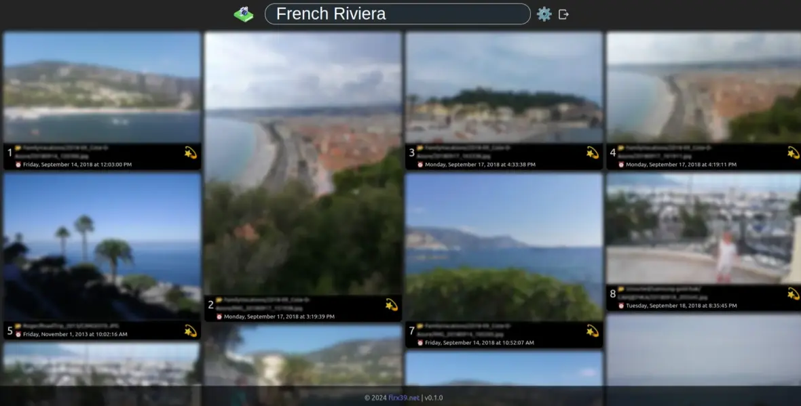

# Photo Search by flrx39.net


This repository holds everything needed to run a browser GUI offering semantic
search for your own photos.

## High-level Overview

Photo Search comes with a few separate components.

* An _indexing script_ ([`embeddings/index-photos.py`](embeddings/index-photos.py))
  that calculates vector embeddings for photos and sends these embeddings to an
  _indexing server_. This is designed to be run directly on a machine with decent
  hardware (and a GPU) to get fast indexing.
* A minimal _embedding server script_ ([`embeddings/server.py`](embeddings/server.py))
  that calculates vector embeddings for multi-lingual natural language queries
  such that these queries can be matched with embeddings calculated for photos.
  This is designed to be run directly on a machine with decent hardware (and a
  GPU) to get fast embedding creation.
* An executable _web server_ ([`srv/web/`](srv/web/)) written in go that offers
  HTTP endpoints for the above mentioned _indexing server_ as well as endpoints
  to search and retrieve photos from the browser GUI. This is designed to be
  run inside a Kubernetes cluster with access to the embedding server.
* A modern _browser GUI_ ([`client/`](client/)) written largely in TypeScript
  and using react that uses the above web server to search and retrieve the
  photos. The static assets produced for the client are designed to be served
  by the above _web server_.

Access to the GUI is only granted for authenticated users (more on this later)
such that you can enjoy searching your photos without making them available to
everybody. Future releases may allow to configure anonymous access though.

## Screenshots

Here's (a blurred) view of the photos from a sample set of about 15K photos
when searching for `French Riviera`.



## How to run

First of all, you need to make sure the models used to create embeddings for
photos and textual queries are available on the machines that run the _embedding
server_ and the _indexing script_. The [.models/download.sh](.models/download.sh)
script helps you with this:

```bash
cd .models
# This requires git and git LFS:
./download.sh
```

You can run the _embedding server_ using the [embeddings/server.sh](embeddings/server.sh)
helper script as follows (example):

```bash
embeddings/server.sh
# or to run in the background, for example
nohup embeddings/server.sh &
```

Run the _web server_ as follows (example):

```bash
web --qdrant-addr=qdrant-photos:6334 \
    --qdrant-coll=my-photos \
    --mbed=http://gpu-host:8082/ \
    --photos=/mnt/nfs/photos
```

Before the Photo Search web server can return any meaningful results, you will
need to index all your photos. This requires Python 3.10+, and access to the
internal REST APIs of the _web server_ (the parameter `http://web-server:8081/`
in the example below). You can run the _indexing script_ as follows (example):

```bash
# Setup and activate the virtual environment for Python:
. embeddings/setup.sh
# Run the indexing script:
python embeddings/index-photos.py /mnt/nfs/photos http://web-server:8081/
```

> **Note**: It is important that the root path passed to indexing script refers
    to the same directory as the path passed to the web server. This is because
    the indexing script will construct relative paths for indexed photos that
    will be stored in the vector database. If the two components cannot find
    photos in the same relative location, Photo Search won't work properly.

### Authentication

Authentication is required and cannot be turned off as of yet. This it to make
sure that running Photo Search is safe and helping you protect your privacy
out-of-the-box. The _web server_ expects a file in a subdirectory of the work
directory, called `config`, and in that directory, there needs to be a file
called `oauth.yaml`. That file must hold the configuration needed to configure
an OIDC-compliant identity provider both for use with the SPA to initiate
authentication and fetch bearer tokens, as well as for the server to know which
bearer tokens to trust.

| Item | Description | Required? |
|---|---|---|
| `clientId` | The client ID parameter to use from the SPA when authenticating with the IdP. | ✅ |
| `authority` | The authority the SPA should when authenticating with the IdP. It must provide the `.well-known/openid-configuration` endpoint for discovery. | ✅ |
| `scopes` | An array of scopes the SPA should ask for when authenticating the user. | |
| `audience` | The audience of bearer tokens expected for authenticated users. The server will verify that the audience matches. | ✅ |
| `issuer` | The issuer of bearer tokens expected for authenticated users. The server will verify that the issuer matches. In some cases this is the same as the `authority`. | ✅ |

For example:

#### Example: Microsoft Entra ID (v2)

```yaml
clientId: 0f9ab9ed-c161-4dbf-a24a-82d3419426db
authority: https://login.microsoftonline.com/domain.com/
audience: api://photos.domain.com
issuer: https://login.microsoftonline.com/0b3523d1-ae5d-48f1-b4ba-e655c4203de1/v2.0
scopes:
  - api://photos.domain.com/Photos.Read
```

#### Example: Microsoft Entra ID (v1)

```yaml
clientId: 0f9ab9ed-c161-4dbf-a24a-82d3419426db
authority: https://sts.windows.net/0b3523d1-ae5d-48f1-b4ba-e655c4203de1/
blah: https://login.microsoftonline.com/oger.li/
audience: api://0f9ab9ed-c161-4dbf-a24a-82d3419426db
issuer: https://sts.windows.net/0b3523d1-ae5d-48f1-b4ba-e655c4203de1/
scopes:
  - api://0f9ab9ed-c161-4dbf-a24a-82d3419426db/Photos.Read
```

### Runtime dependencies

This section explains how details on the dependencies needed by Photo Search at
runtime are made available to the web server.

#### Qdrant vector database

Photo Search needs access to a [Qdrant](https://qdrant.tech/) vector database.
See [Installation - Qdrant](https://qdrant.tech/documentation/guides/installation/)
for installation options. Once installed, you can advertise to the web server
by passing the following flags:

| Flag | Description | Default value |
|---|---|---|
| `--qdrant-addr=<host:port>` | Host and port of the Qdrant gRPC API. | `--qdrant-addr=qdrant:6334` |
| `--qdrant-coll=<collection>` | Name of the Qdrant collection to hold vectors and metadata for photos. | `--qdrant-coll=photos` |

#### Embeddings Server

The embeddings server is needed to create embeddings for textual queries on your
photos. To let the Photo Search web server know how to connect to this (internal)
service, the `--mbed=<base-url>` flag must be set. The default value is
`http://localhost:8082/`.

#### Photos storage

The web server also needs read-only access to the photos to be searched to. This
is to allow limiting access only to authenticated users, and to create previews
for search results.
The root path to the photos is configured through the `--photos=<path>` flag,
which by default is left empty.

### Run on Kubernetes

Photo Search is largely designed to run on Kubernetes, though it can run outside
of Kubernetes too.

TODO: More details on how to run on Kubernetes.
